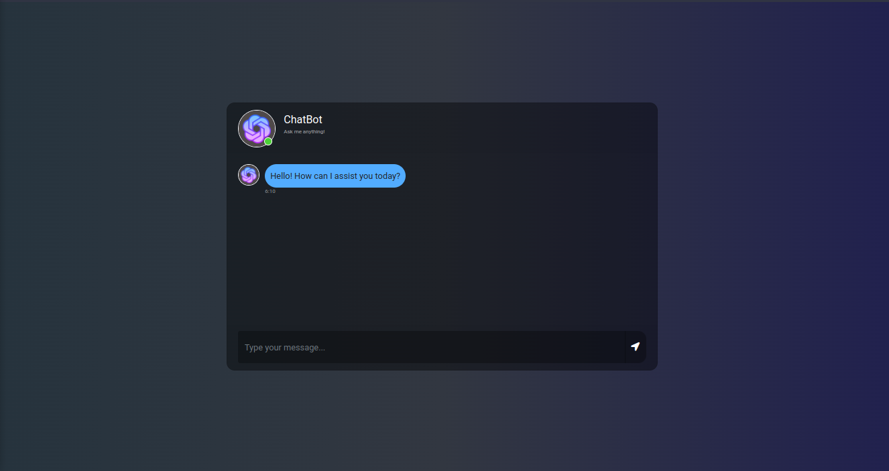
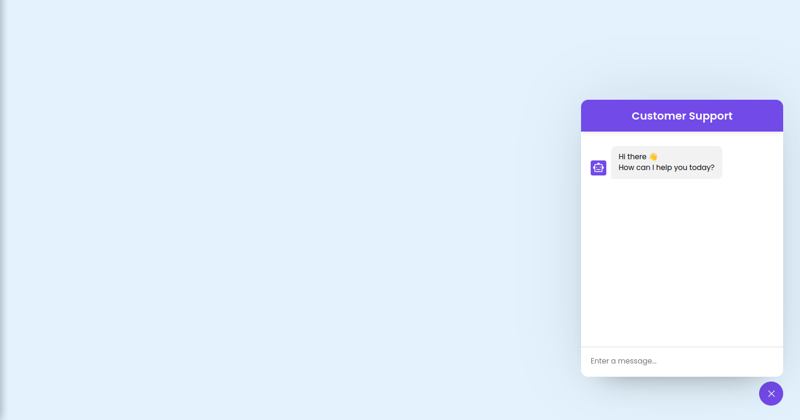

# Customer Support Chatbot Using Openai Assistant Api

This project is knowledge based chatbot using python flask,openai assistant api and also included two frontend template to test the api.


## Environment Variables

To run this project, you will need to add the following environment variables to your .env.sample file and rename this filename .env

`OPENAI_API_KEY`

## Run Locally

Clone the project

```bash
  git clone https://github.com/smrussel/flask-openai-assistant-api.git
```

Go to the project directory

```bash
  cd flask-openai-assistant-api
```

Install dependencies

```bash
  pip install -r requirements.txt
```

Start the server

```bash
  python app.py
```


## Screenshots

### Fontend-1



### Fontend-2


## License

[MIT](./LICENSE)

